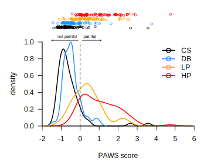

## paws: Pain Assessment at Withdrawal Speeds

Automated pain scoring from paw withdrawl tracking data based on
[Jones et al. (2020)](https://doi.org/10.1101/2020.02.18.955070)
A machine-vision approach for automated pain measurement at millisecond
timescales. This R package takes paw trajectory data in response to a
stimulus and provides an automated scoring of pain.

### Installing

Using the devtools package (the first line can be skipped if devtools is
already installed), in R run:

```R
install.packages("devtools")
devtools::install_github("crtwomey/paws")
```

### Compiling

To compile from the commandline, cd to the parent directory of the paws
repository and run

```console
$ R CMD build paws
$ R CMD install paws_1.0.0.tar.gz
```

### Usage

The package documentation explains the three main functions:
extract_features, pain_score, and pain_class. A simple example
is shown here using paw trajectory data from Jones et al.,
which is included with the package as jones2020.tracks.

```R
# compute features for Jones et al. (2020) paw trajectories
paw.features <- lapply(jones2020.tracks, function(track) {
	extract_features(track$time.series)
})

# get strain information for each track
strains <- sapply(jones2020.tracks, function(track) track$strain)

# compute pain scores
scores <- pain_score(paw.features, strains=strains)
```

Plotting the kernel density estimates of score distributions by stimulus
(excluding strain SJL; see the paper) reproduces Fig. 4I of Jones et al.



### Credit

Please cite [Jones et al. (2020)](https://doi.org/10.1101/2020.02.18.955070)
and include a link to this repository if you use this code in an academic
publication.

Testing, bug reports, and code contributions very welcome.

Copyright (c) 2019, 2020 Colin Twomey.
Shared under a GNU GPLv3 license (see COPYING).

